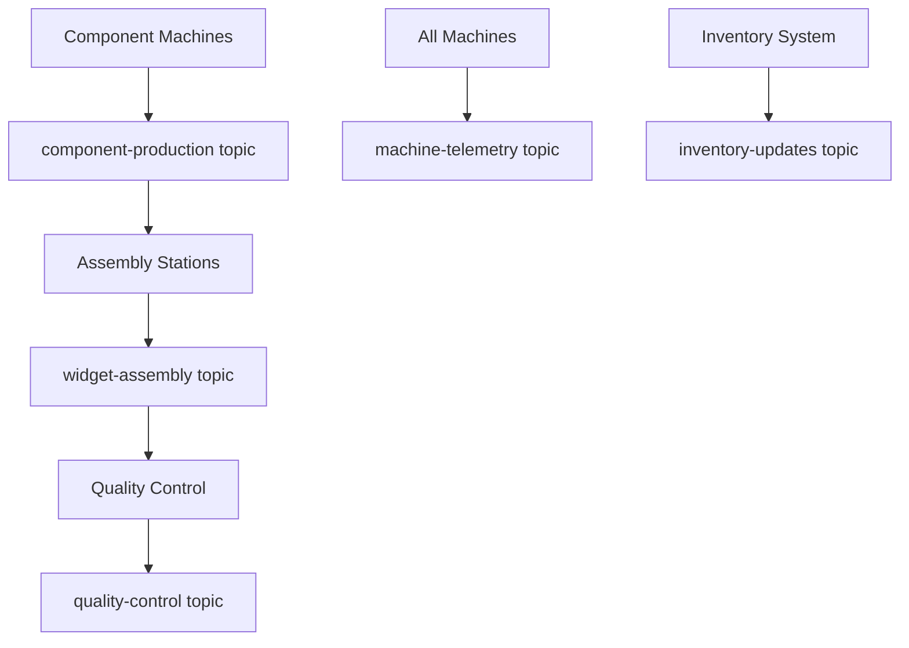

# Widget Factory Data Engineering Walkthrough

A complete manufacturing data pipeline simulation using Kafka to demonstrate real-world data engineering patterns.

## 🏭 System Overview

The Widget Factory simulates a complete manufacturing pipeline:

1. **Component Production** - Machines produce individual components
2. **Widget Assembly** - Components are assembled into finished widgets
3. **Quality Control** - Widgets undergo quality inspections
4. **Machine Telemetry** - IoT sensors monitor machine health
5. **Inventory Management** - Track component and widget stock levels

## 📁 Project Structure

```
widget_factory/
├── schemas.py                           # Data schemas and enums
├── component_production_simulator.py    # Simulates component manufacturing
├── widget_assembly_simulator.py        # Simulates widget assembly
├── quality_control_simulator.py        # Simulates QC inspections
├── machine_telemetry_simulator.py      # Simulates IoT sensor data
├── setup_factory.sh                    # Creates all Kafka topics
├── requirements.txt                     # Python dependencies
└── README.md                           # This file
```

## 🚀 Quick Start

### 1. Prerequisites Setup

```bash
# Make sure Kafka is running (from your main project)
cd /path/to/your/kafka-project
docker-compose up -d

# Create widget factory directory
mkdir widget_factory
cd widget_factory
```

### 2. Copy All Files

Copy each of the following files into your `widget_factory/` directory:
- `schemas.py`
- `component_production_simulator.py`
- `widget_assembly_simulator.py`
- `quality_control_simulator.py`
- `machine_telemetry_simulator.py`
- `setup_factory.sh`
- `requirements.txt`

### 3. Set Up Environment

```bash
# Create virtual environment
python3 -m venv venv
source venv/bin/activate

# Install dependencies
pip install -r requirements.txt

# Make setup script executable
chmod +x setup_factory.sh

# Create all Kafka topics
./setup_factory.sh
```

## 🎮 Running the Simulation

### Full Factory Simulation (4 Terminals)

**Terminal 1 - Component Production:**
```bash
cd widget_factory
source venv/bin/activate
python component_production_simulator.py
```

**Terminal 2 - Widget Assembly:**
```bash
cd widget_factory
source venv/bin/activate
python widget_assembly_simulator.py
```

**Terminal 3 - Quality Control:**
```bash
cd widget_factory
source venv/bin/activate
python quality_control_simulator.py
```

**Terminal 4 - Machine Telemetry:**
```bash
cd widget_factory
source venv/bin/activate
python machine_telemetry_simulator.py
```

### Step-by-Step Testing

**1. Start with Component Production Only:**
```bash
python component_production_simulator.py
```
This will produce components and send them to the `component-production` topic.

**2. Add Widget Assembly:**
```bash
# In another terminal
python widget_assembly_simulator.py
```
This consumes components and produces assembled widgets.

**3. Add Quality Control:**
```bash
# In another terminal
python quality_control_simulator.py
```
This consumes assembled widgets and performs quality checks.

**4. Add Machine Monitoring:**
```bash
# In another terminal
python machine_telemetry_simulator.py
```
This generates IoT telemetry data from all machines.

## 📊 Data Flow



## 🔍 Monitoring Your Factory

### View Messages in Real-Time

**Component Production:**
```bash
docker exec -it kafka kafka-console-consumer \
    --topic component-production \
    --bootstrap-server localhost:9092 \
    --from-beginning
```

**Widget Assembly:**
```bash
docker exec -it kafka kafka-console-consumer \
    --topic widget-assembly \
    --bootstrap-server localhost:9092 \
    --from-beginning
```

**Quality Control:**
```bash
docker exec -it kafka kafka-console-consumer \
    --topic quality-control \
    --bootstrap-server localhost:9092 \
    --from-beginning
```

**Machine Telemetry:**
```bash
docker exec -it kafka kafka-console-consumer \
    --topic machine-telemetry \
    --bootstrap-server localhost:9092 \
    --from-beginning
```

### Check Consumer Groups

```bash
docker exec -it kafka kafka-consumer-groups \
    --list --bootstrap-server localhost:9092
```

### View Consumer Lag

```bash
docker exec -it kafka kafka-consumer-groups \
    --describe --group assembly-stations \
    --bootstrap-server localhost:9092
```

## 📈 What You'll See

### Component Production Output:
```
INFO:__main__:Component produced: COMP_METAL_FRAME_a1b2c3d4 (metal_frame) on FRAME_MACHINE_01
INFO:__main__:Component produced: COMP_PLASTIC_HOUSING_e5f6g7h8 (plastic_housing) on PLASTIC_MOLD_01
```

### Widget Assembly Output:
```
INFO:__main__:Widget assembled: WIDGET_BASIC_WIDGET_x9y8z7w6 (basic_widget) at ASSEMBLY_STATION_A
INFO:__main__:Added production order: 5x premium_widget
```

### Quality Control Output:
```
INFO:__main__:Quality check: WIDGET_BASIC_WIDGET_x9y8z7w6 - PASS
WARNING:__main__:Widget WIDGET_PREMIUM_WIDGET_a1b2c3d4 failed QC: ['performance_below_standard']
```

### Machine Telemetry Output:
```
INFO:__main__:Starting telemetry simulation for FRAME_MACHINE_01
WARNING:__main__:Machine PCB_ASSEMBLER_01 in ERROR state!
```

## 🧪 Experiment Ideas

### 1. **Supply Chain Disruption**
- Stop component production and watch assembly stations run out of components
- Restart production and see the backlog clear

### 2. **Quality Issues**
- Monitor quality control pass/fail rates
- Analyze which widget types have more defects

### 3. **Machine Downtime**
- Watch for machines going into ERROR or MAINTENANCE status
- See how it affects overall production

### 4. **Demand Spikes**
- Add large production orders to widget assembly
- Watch component inventory drain and replenish

### 5. **Performance Analytics**
- Calculate average assembly times by widget type
- Monitor machine efficiency metrics
- Track quality pass rates over time

## 🔧 Customization

### Change Production Rates
Edit the cycle times in `component_production_simulator.py`:
```python
cycle_times = {
    "FRAME_MACHINE_01": 30,  # Faster production (30 seconds)
    "PLASTIC_MOLD_01": 60,   # Slower production (60 seconds)
    # ...
}
```

### Add New Widget Types
1. Add to `WidgetType` enum in `schemas.py`
2. Add recipe to `WIDGET_RECIPES`
3. Update quality standards in `quality_control_simulator.py`

### Inject Failures
```python
# In machine_telemetry_simulator.py
telemetry_simulator.simulate_anomaly("FRAME_MACHINE_01")
```

## 🎯 Learning Objectives

This simulation demonstrates:

- **Event-Driven Architecture** - Loosely coupled systems communicating via events
- **Stream Processing** - Real-time data processing pipelines
- **Data Schemas** - Structured data contracts between services
- **Consumer Groups** - Scalable message processing
- **Error Handling** - Dealing with failures in distributed systems
- **Monitoring** - Observability in data pipelines
- **Back-pressure** - What happens when consumers can't keep up

## 🚨 Troubleshooting

**"No module named 'schemas'":**
```bash
# Make sure you're running from the widget_factory directory
cd widget_factory
python component_production_simulator.py
```

**"No available brokers":**
```bash
# Make sure Kafka is running
docker-compose ps
# If not running:
docker-compose up -d
```

**Assembly station has no components:**
```bash
# Make sure component production is running first
# Check component production topic has messages:
docker exec -it kafka kafka-console-consumer \
    --topic component-production \
    --bootstrap-server localhost:9092 \
    --from-beginning
```

**Consumer lag building up:**
```bash
# Check consumer group status
docker exec -it kafka kafka-consumer-groups \
    --describe --group assembly-stations \
    --bootstrap-